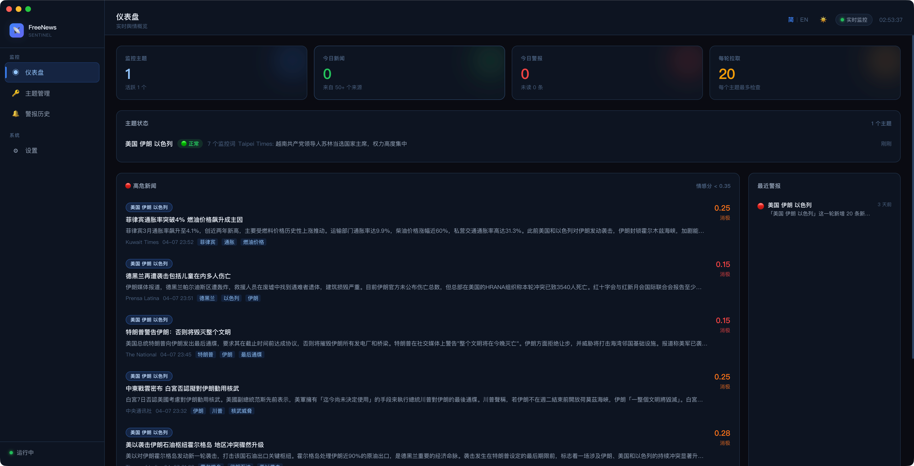
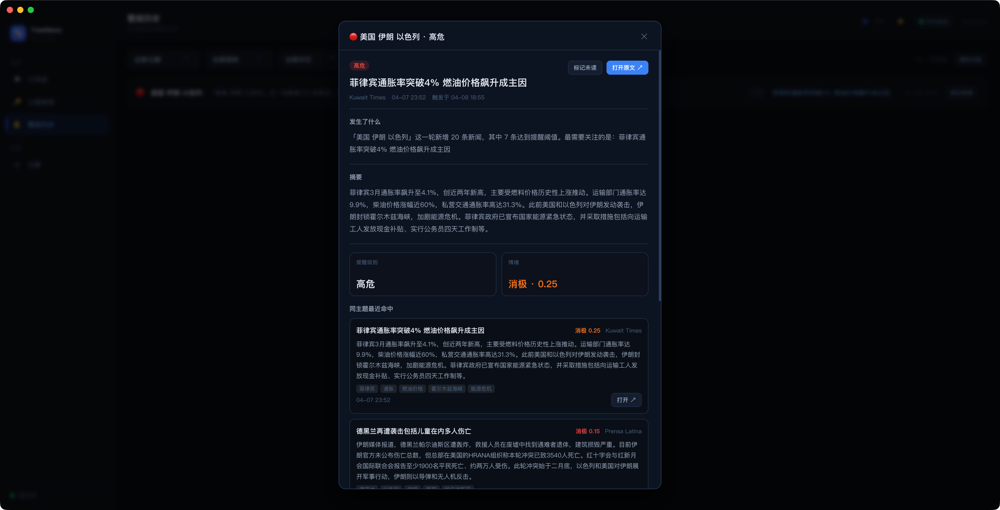
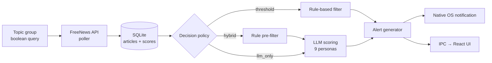

<div align="center">

<h1>FreeNews Sentinel</h1>

<p>
  <strong>Local-first AI news sentinel for traders, analysts &amp; PR teams.<br/>
  Bring your own LLM. Track any topic. Get alerted before the market does.</strong>
</p>

<p>
  <a href="https://github.com/hibanabo/freenews-sentinel/actions/workflows/build.yml"></a>
  <a href="https://github.com/hibanabo/freenews-sentinel/releases/latest"></a>
  <a href="./LICENSE"></a>
  <a href="https://github.com/hibanabo/freenews-sentinel/releases"></a>
</p>

<p>
  <a href="https://github.com/hibanabo/freenews-sentinel/stargazers"></a>
  <a href="https://github.com/hibanabo/freenews-sentinel/releases"></a>
  <a href="https://www.electronjs.org/"></a>
  <a href="#-faq"></a>
</p>

<p>
  <a href="#-quick-start">Download</a> ·
  <a href="#-why-freenews-sentinel">Why</a> ·
  <a href="#-features">Features</a> ·
  <a href="#-how-it-works">How it works</a> ·
  <a href="#-faq">FAQ</a> ·
  <a href="#-roadmap">Roadmap</a>
</p>

<p>
  <b>English</b> · <a href="./README.zh-CN.md">简体中文</a>
</p>



</div>

---

## 🔭 Why FreeNews Sentinel

You can't read every headline that mentions your portfolio, your brand, or the regulator that controls your business. Existing options aren't enough:

- **Google Alerts** is slow, title-only, and has no risk scoring.
- **Paid SaaS** runs $50–500/mo and locks your topics in someone else's cloud.
- **Generic RSS readers** drown you in noise and never tell you which 3 of 200 stories actually matter.

**FreeNews Sentinel** runs on your laptop, pulls global news through a free API, and lets a local or cloud LLM rate every story for relevance, sentiment, urgency, and impact direction — through one of **9 built-in analyst personas** (OSINT operative, equity trader, crypto trader, PR director, compliance officer, supply-chain analyst, journalist, tech competitor, generalist). Articles that cross your thresholds fire native desktop notifications with the model's reasoning attached.

> Example: a crypto trader sets `BTC` + regulation keywords with a `hybrid` decision policy. A new SEC enforcement headline arrives. The local sentiment score is `-0.62`, the LLM rates impact `0.84 / negative / urgency:high`, and a system notification fires within seconds — all of it stored in a local SQLite DB you can query later.

---

## 📸 Demo

| Dashboard | Alert detail |
|---|---|
|  |  |

---

## ✨ Features

- 🛰️ **Topic monitoring** — boolean query expressions, batch group management
- 🎭 **9 analyst personas** — OSINT, equity, crypto, PR crisis, compliance, supply chain, media, tech competitive, generalist (fully editable, plus your own)
- 🤖 **3 decision modes** — `threshold` (rules only) · `hybrid` (rules pre-filter, LLM scores survivors) · `llm_only` (every article goes to the model)
- 📉 **Multi-axis scoring** — sentiment, relevance, impact magnitude + direction, urgency
- 🔔 **Native OS alerts** — severity levels, per-keyword cooldown, click-through to article
- 📰 **Auto briefing** — scheduled AI-generated digests of what mattered today
- 🔒 **Secure by design** — API keys in OS keychain (Keychain / Credential Manager / libsecret), full process isolation, no telemetry
- 🌐 **Bilingual UI** — English / 简体中文, dark / light theme

---

## 🚀 Quick Start

### Download a release (recommended)

→ [**Releases**](https://github.com/hibanabo/freenews-sentinel/releases) — `.dmg` for macOS · `.exe` for Windows · `.AppImage` for Linux

> ⚠️ macOS / Windows builds are unsigned today. See [FAQ](#-faq) for how to bypass Gatekeeper / SmartScreen.

### Build from source

```bash
git clone https://github.com/hibanabo/freenews-sentinel.git
cd freenews-sentinel
npm install
npm run dev
```

```bash
# Package for your platform
npm run package:mac    # macOS
npm run package:win    # Windows
npm run package:linux  # Linux
```

### Configure

1. Get a free API key at **[freenews.site](https://freenews.site)** — the data source backing this app.
2. Open the app → **Settings** → paste your **FreeNews API Key**.
3. *(Optional)* Toggle **AI Analysis** → pick OpenAI, Anthropic, or any OpenAI-compatible local endpoint (Ollama, LM Studio, vLLM…).
4. **Keywords** → create a topic group → monitoring starts automatically.

---

## 🧠 How It Works



The decision layer is the heart of the app. `threshold` is fast and free; `llm_only` is slow and costs tokens; `hybrid` is what most users actually want — let cheap rules drop 90% of obviously-irrelevant articles, then spend LLM tokens only on the ones that might actually matter.

---

## 🔍 Comparison

|  | FreeNews Sentinel | Google Alerts | Feedly Pro+ AI | Paid SaaS (Meltwater etc.) |
|---|---|---|---|---|
| Local-first / your data stays on your machine | ✅ | ❌ | ❌ | ❌ |
| Open source | ✅ | ❌ | ❌ | ❌ |
| AI risk + sentiment scoring | ✅ | ❌ | ⚠️ basic | ✅ |
| Specialized analyst personas | ✅ 9 built-in | ❌ | ❌ | ⚠️ generic |
| Native desktop notifications | ✅ | ❌ (email only) | ⚠️ web push | ⚠️ varies |
| Bring your own LLM (incl. local) | ✅ | ❌ | ❌ | ❌ |
| Price | Free (you pay LLM) | Free | $12+/mo | $500+/mo |

---

## 🗺️ Roadmap

Interested in any of these? Vote / discuss in [Issues](https://github.com/hibanabo/freenews-sentinel/issues) — the order is driven by what people actually ask for.

- [ ] RSS / Atom feeds as an additional data source (alongside FreeNews API)
- [ ] Webhook & Slack/Discord/Telegram alert sinks
- [ ] User-defined analyst personas with prompt templates and live preview
- [ ] Per-keyword analytics: volume, sentiment trend, top sources
- [ ] Multi-account / workspace switching
- [ ] Mobile companion app (push-only, read-only)
- [ ] One-click export of alerts to Notion / Obsidian / CSV

---

## ❓ FAQ

<details>
<summary><b>What is the FreeNews API and do I have to pay?</b></summary>

[freenews.site](https://freenews.site) is the data source this app was built around — it aggregates global news with bilingual titles/summaries. There is a free tier that's enough for personal monitoring. The app stores no API keys on any remote server; your key lives in the OS keychain only.

</details>

<details>
<summary><b>Will my articles be uploaded to OpenAI / Anthropic?</b></summary>

Only if you turn on AI Analysis with a cloud provider. In that case, the article title and summary (not the full body) are sent to the provider you configured for scoring. If you don't want any cloud calls, point the AI base URL at a local Ollama / LM Studio / vLLM endpoint — the app uses the OpenAI chat-completions schema, so any OpenAI-compatible server works.

</details>

<details>
<summary><b>Can I run it 100% locally with Ollama?</b></summary>

Yes. In Settings, set:
- **Base URL**: `http://127.0.0.1:11434/v1`
- **Model**: e.g. `qwen2.5:14b`, `llama3.1:8b`
- **API Key**: leave blank (the app detects local endpoints and skips the auth header)

</details>

<details>
<summary><b>How is this different from Google Alerts?</b></summary>

Google Alerts gives you a delayed email with a title and a link. FreeNews Sentinel gives you a live desktop notification within seconds, with sentiment / relevance / urgency / impact-direction scores and the model's reasoning attached, all queryable in a local SQLite database.

</details>

<details>
<summary><b>The macOS / Windows installer says it's from an unidentified developer.</b></summary>

Builds are unsigned for now (code-signing certificates cost a few hundred dollars a year and we're optimizing for "free and open"). Workarounds:

- **macOS**: right-click the `.dmg` → Open, or run `xattr -cr /Applications/FreeNews\ Sentinel.app` after first launch.
- **Windows**: SmartScreen → "More info" → "Run anyway".
- **Linux** `.AppImage` is unsigned by design and runs as-is.

If you'd prefer a signed build, [open an issue](https://github.com/hibanabo/freenews-sentinel/issues/new/choose) — once enough people ask, signing becomes worth the cost.

</details>

<details>
<summary><b>Where is my data stored?</b></summary>

Everything lives under your Electron `userData` directory:
- Articles, alerts, briefs, settings → local SQLite (`better-sqlite3`)
- API keys → OS keychain via `keytar`
- UI preferences → `electron-store` JSON

Nothing leaves your machine except (a) requests to the FreeNews API for news, and (b) requests to your configured LLM provider if you enabled AI Analysis.

</details>

---

## 🛠️ Tech Stack

`Electron` · `electron-vite` · `React 18` · `TypeScript (strict)` · `Zustand` · `better-sqlite3` · `keytar` · `electron-store`

CI: GitHub Actions multi-OS build · Releases: `electron-builder`

---

## 🤝 Contributing

PRs and issues welcome — see [**CONTRIBUTING.md**](CONTRIBUTING.md) for the dev loop, code style, i18n requirements, and how to add a new analyst persona.

If you found a bug or have a feature idea: [open an issue](https://github.com/hibanabo/freenews-sentinel/issues/new/choose).

If you just want to say "this is useful" — a ⭐ on the repo is the cheapest way to keep this project alive.

---

## 📄 License

[MIT](LICENSE) © 2026 FreeNews Sentinel contributors.

Maintained by [@hibanabo](https://github.com/hibanabo). FreeNews Sentinel is the desktop client; the FreeNews API at [freenews.site](https://freenews.site) is the data source.
