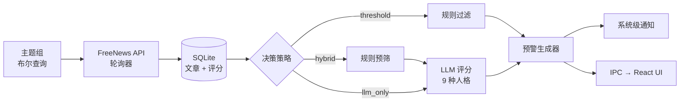

<div align="center">

<h1>FreeNews Sentinel</h1>

<p>
  <strong>本地优先的 AI 舆情哨兵，专为投资者、分析师、公关团队打造。<br/>
  自带模型、追踪任意主题、比市场早一步收到预警。</strong>
</p>

<p>
  <a href="https://github.com/hibanabo/freenews-sentinel/actions/workflows/build.yml"></a>
  <a href="https://github.com/hibanabo/freenews-sentinel/releases/latest"></a>
  <a href="./LICENSE"></a>
  <a href="https://github.com/hibanabo/freenews-sentinel/releases"></a>
</p>

<p>
  <a href="https://github.com/hibanabo/freenews-sentinel/stargazers"></a>
  <a href="https://github.com/hibanabo/freenews-sentinel/releases"></a>
  <a href="https://www.electronjs.org/"></a>
  <a href="#-常见问题"></a>
</p>

<p>
  <a href="#-快速开始">下载</a> ·
  <a href="#-为什么需要-freenews-sentinel">为什么</a> ·
  <a href="#-功能特性">功能</a> ·
  <a href="#-工作原理">工作原理</a> ·
  <a href="#-常见问题">FAQ</a> ·
  <a href="#-路线图">路线图</a>
</p>

<p>
  <a href="./README.md">English</a> · <b>简体中文</b>
</p>


</div>

---

## 🔭 为什么需要 FreeNews Sentinel

你不可能盯完每一条提到你持仓、你品牌、或监管你这个行业的新闻。现成的工具都不够用：

- **Google Alerts** — 延迟高、只给标题、没有风险评分。
- **付费 SaaS（Meltwater 等）** — 每月 50–500 美元，主题和数据全锁在别人的云里。
- **通用 RSS 阅读器** — 信息过载，永远不会告诉你 200 条里哪 3 条真正重要。

**FreeNews Sentinel** 跑在你自己的电脑上，通过一个免费 API 拉全球新闻，让本地或云端 LLM 给每条新闻打 4 项分（相关度、情感、紧迫度、影响方向），背后是 **9 个内置分析师人格**：OSINT 情报员、股票投资者、加密交易员、公关总监、合规官、供应链顾问、资深财经记者、科技战略分析师、通用舆情分析师。命中阈值的文章直接走系统级通知推到你面前，附带模型的判断理由。

> 例子：一位加密交易员配置了 `BTC` + 监管类关键词，使用 `hybrid` 决策策略。一条 SEC 执法新闻进来，本地情感得分 `-0.62`，LLM 评分 `影响:0.84 / 方向:负面 / 紧迫度:高`，系统通知在数秒内弹出 —— 所有数据都落在本地 SQLite 里，事后随时可以回查。

---

## 📸 演示

| 仪表盘 | 预警详情 |
|---|---|
|  |  |

---

## ✨ 功能特性

- 🛰️ **主题监控** — 布尔查询表达式，主题分组批量管理
- 🎭 **9 个分析师人格** — OSINT、股票、加密、公关危机、合规、供应链、媒体、科技竞争、通用（全部可改可加，也可自建）
- 🤖 **3 档决策模式** — `threshold`（纯规则）· `hybrid`（规则预筛 + LLM 打分）· `llm_only`（每条都过模型）
- 📉 **多维度评分** — 情感、相关度、影响幅度 + 方向、紧迫度
- 🔔 **系统级通知** — 严重等级、按关键词冷却、点击直达原文
- 📰 **AI 自动简报** — 定时生成"今天到底发生了什么重要的事"
- 🔒 **安全设计** — API Key 存系统钥匙串（Keychain / 凭据管理器 / libsecret），完整进程隔离，无任何遥测
- 🌐 **双语界面** — 中英文、深色 / 浅色主题

---

## 🚀 快速开始

### 下载安装包（推荐）

→ [**Releases**](https://github.com/hibanabo/freenews-sentinel/releases) — macOS `.dmg` · Windows `.exe` · Linux `.AppImage`

> ⚠️ 当前 macOS / Windows 安装包未签名。如何绕过 Gatekeeper / SmartScreen 见 [常见问题](#-常见问题)。

### 从源码构建

```bash
git clone https://github.com/hibanabo/freenews-sentinel.git
cd freenews-sentinel
npm install
npm run dev
```

```bash
# 打包当前平台安装包
npm run package:mac    # macOS
npm run package:win    # Windows
npm run package:linux  # Linux
```

### 配置

1. 在 **[freenews.site](https://freenews.site)** 注册获取免费 API Key —— 这是本应用的新闻数据源。
2. 打开应用 → **设置** → 填入 **FreeNews API Key**。
3.（可选）开启 **AI 分析** → 选择 OpenAI、Anthropic、或任何 OpenAI 兼容的本地端点（Ollama、LM Studio、vLLM 等）。
4. 进入 **主题管理** → 创建主题组 → 监控自动启动。

---

## 🧠 工作原理



决策层是整个应用的核心。`threshold` 速度快、零成本；`llm_only` 慢、烧 token；`hybrid` 才是大多数用户真正想要的 —— 让便宜的规则把 90% 明显无关的文章先过滤掉，剩下可能重要的再花 LLM token 精读。

---

## 🔍 横向对比

|  | FreeNews Sentinel | Google Alerts | Feedly Pro+ AI | 付费 SaaS（Meltwater 等） |
|---|---|---|---|---|
| 本地优先 / 数据留在你机器上 | ✅ | ❌ | ❌ | ❌ |
| 开源 | ✅ | ❌ | ❌ | ❌ |
| AI 风险 + 情感打分 | ✅ | ❌ | ⚠️ 基础 | ✅ |
| 专业分析师人格 | ✅ 9 种内置 | ❌ | ❌ | ⚠️ 通用 |
| 系统级桌面通知 | ✅ | ❌（仅邮件） | ⚠️ 网页推送 | ⚠️ 各家不同 |
| 自带模型（含本地） | ✅ | ❌ | ❌ | ❌ |
| 价格 | 免费（你只付 LLM 费用） | 免费 | $12+/月 | $500+/月 |

---

## 🗺️ 路线图

对哪一项感兴趣？欢迎在 [Issues](https://github.com/hibanabo/freenews-sentinel/issues) 投票或讨论 —— 谁声音大谁先做。

- [ ] RSS / Atom 数据源（与 FreeNews API 并存）
- [ ] Webhook、Slack / Discord / Telegram 等预警通道
- [ ] 自定义分析师人格 + 提示词模板 + 实时预览
- [ ] 关键词分析视图：声量、情感趋势、热门来源
- [ ] 多账户 / 工作区切换
- [ ] 移动端伴随应用（只推送、只读）
- [ ] 一键导出预警到 Notion / Obsidian / CSV

---

## ❓ 常见问题

<details>
<summary><b>FreeNews API 是什么？要付费吗？</b></summary>

[freenews.site](https://freenews.site) 是本应用所基于的全球新闻数据源，提供双语标题与摘要。免费额度足够个人监控使用。本应用从不向任何远程服务上传 API Key —— 你的 Key 只存在本地系统钥匙串里。

</details>

<details>
<summary><b>我的文章会被上传到 OpenAI / Anthropic 吗？</b></summary>

只有当你启用了 AI 分析 + 选择了云端 provider 时，文章的标题和摘要（不是全文）会发给你配置的 provider 用于打分。如果你不希望任何外发请求，把 AI Base URL 指向本地 Ollama / LM Studio / vLLM 就行 —— 应用使用的是 OpenAI chat-completions 协议，任何兼容服务都可以。

</details>

<details>
<summary><b>能完全离线（用 Ollama）跑吗？</b></summary>

可以。设置里填：
- **Base URL**：`http://127.0.0.1:11434/v1`
- **模型**：例如 `qwen2.5:14b`、`llama3.1:8b`
- **API Key**：留空（应用检测到本地端点会自动跳过 Auth header）

</details>

<details>
<summary><b>和 Google Alerts 比有什么区别？</b></summary>

Google Alerts 给你延迟的邮件 + 标题 + 链接。FreeNews Sentinel 在数秒内推送系统级通知，附带情感 / 相关度 / 紧迫度 / 影响方向四项打分和模型推理理由，所有数据落在本地 SQLite 里随时可查。

</details>

<details>
<summary><b>macOS / Windows 提示"开发者无法验证"</b></summary>

当前安装包未签名（代码签名证书一年要几百美元，目前优先保持"免费 + 开源"）。绕开方法：

- **macOS**：右键 `.dmg` → 打开；首次启动后如仍被拦，运行 `xattr -cr /Applications/FreeNews\ Sentinel.app`。
- **Windows**：SmartScreen → "更多信息" → "仍要运行"。
- **Linux** `.AppImage` 本就不需要签名，直接运行。

如果你强烈希望有签名版本，请 [开个 issue](https://github.com/hibanabo/freenews-sentinel/issues/new/choose) —— 等需求够多了我们就上签名。

</details>

<details>
<summary><b>我的数据存在哪里？</b></summary>

全部在 Electron 的 `userData` 目录下：
- 文章、预警、简报、设置 → 本地 SQLite（`better-sqlite3`）
- API Key → 系统钥匙串（`keytar`）
- UI 偏好 → `electron-store` JSON

外发的网络请求只有两类：(a) 给 FreeNews API 拉新闻；(b) 给你配置的 LLM 服务做打分（仅当 AI 分析开启）。

</details>

---

## 🛠️ 技术栈

`Electron` · `electron-vite` · `React 18` · `TypeScript (strict)` · `Zustand` · `better-sqlite3` · `keytar` · `electron-store`

CI：GitHub Actions 多平台构建 · 发布：`electron-builder`

---

## 🤝 贡献

PR 和 issue 都欢迎 —— 开发流程、代码规范、i18n 要求、如何新增分析师人格请看 [**CONTRIBUTING.md**](CONTRIBUTING.md)。

发现 bug 或有功能想法：[开个 issue](https://github.com/hibanabo/freenews-sentinel/issues/new/choose)。

如果你只是想说"这个挺有用" —— 给仓库点个 ⭐ 是让项目活下去最便宜的方式。

---

## 📄 License

[MIT](LICENSE) © 2026 FreeNews Sentinel contributors.

由 [@hibanabo](https://github.com/hibanabo) 维护。FreeNews Sentinel 是桌面客户端；新闻数据源 FreeNews API 在 [freenews.site](https://freenews.site)。
